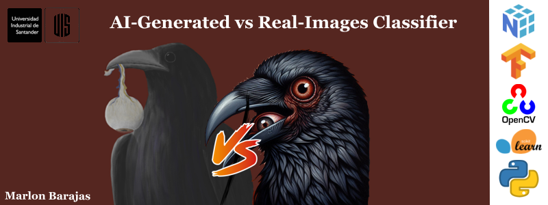

# AI-Generated vs Real-Images Classifier

**Autor:** Marlon Barajas Acelas - [**creepstyC**](https://github.com/creepstyC)

**Objetivo:** Clasificación de imágenes reales vs generadas por AI.

+ **Dataset:** [**AI-Generated vs Real-Images**](https://www.kaggle.com/datasets/cashbowman/ai-generated-images-vs-real-images/data)

+ **Modelo:** DNN, 

[(code)](code.ipynb) [(video)]() [(repo)](https://github.com/creepstyC/ai-real-classifier)